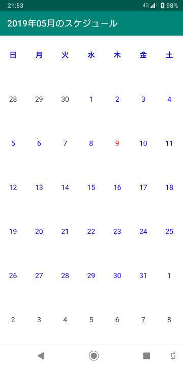
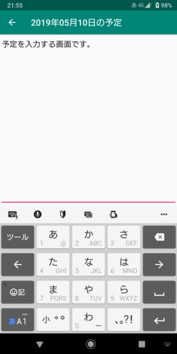

# Schedule App

## 概要

- カレンダーを表示し、スケジュールを入力できるAndroidアプリです。

## 動作環境

- Android 5 (Android API Level 21) 以上。

## インストール

- githubのreleasesのページからダウンロードできます。パッケージファイル (ScheduleApp.apk) のリンクをタップすると、インストールパッケージがダウンロードされ、Androidにインストールしていいか確認を行います。
- アンインストールはAndroidアプリの標準的なアンインストール操作と同じです。
- Google Playに登録していない野良アプリです。自己責任でお願いします。

## 使い方

### カレンダー画面

- 日付を選択する画面。

### メモ入力画面

- 単純なテキストエディタ。
- テキストが保存されるタイミングは、前の画面に戻る時、ウィンドウを閉じる時、ウィンドウがバックグラウンドに移動した時、など。

## バージョン履歴

- 2019/05/09 ScheduleApp v1.00

## 著作権

- RakugakiAppの全ての配布物は「zlib/libpngライセンス」を適用します。
- (C) 2019 aktera.
